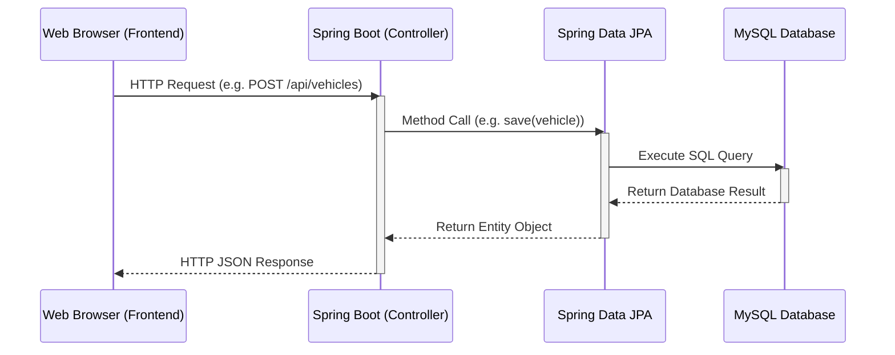
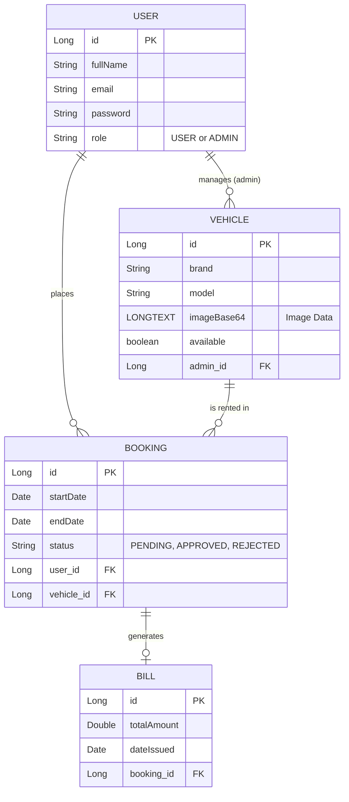

# RentalSphere: Backend Architecture & Documentation

## 1. Overall Application Flow

The following diagram illustrates how the Angular Frontend, Spring Boot Backend, and MySQL Database interact with each other to serve the user.

---

## 2. Backend Technology Stack
- **Framework**: Spring Boot 3 (Java)
- **Database**: MySQL 8.0
- **ORM**: Spring Data JPA (Hibernate)
- **Architecture Pattern**: MVC (Model-View-Controller) / REST API

---

## 3. Database Entity Relationship (ER) Diagram

RentalSphere uses a relational database. The following diagram shows how the core tables are linked together.

---

## 4. Package Structure & Data Flow

The backend follows a strict layered architecture:

### 1. `model` (Entities)
These are Java classes mapped directly to MySQL tables using `@Entity` annotations. 
- **`User.java`**: Stores user authentication and profile data. 
- **`Vehicle.java`**: Represents a car/bike. Contains an `@Lob` `LONGTEXT` field to store Base64 image uploads natively in the database, ensuring portability.
- **`Booking.java`**: Links a `User` to a `Vehicle` with start/end dates.
- **`Bill.java`**: Generated automatically when a Booking is approved.

### 2. `repository` (Data Access Layer)
Interfaces extending `JpaRepository`. They handle all SQL operations automatically (preventing SQL Injection via Prepared Statements).
- **`UserRepository`**: Includes custom method `findByEmail(String email)`.
- **`VehicleRepository`**: Includes `findByAdminId(Long adminId)` and `findByAvailableTrue()`.
- **`BookingRepository`**: Includes `findByUserId(Long userId)`.

### 3. `controller` (REST Endpoints)
These classes handle incoming HTTP requests from Angular and return JSON data.

- **`UserController.java`**: 
  - `POST /api/users/register`: Hashes passwords (in production) and saves new users.
  - `POST /api/users/login`: Authenticates credentials.
  - `PUT /api/users/reset-password`: Verifies email and mobile number before allowing a password reset.

- **`VehicleController.java`**:
  - `GET /api/vehicles`: Returns all available vehicles.
  - `POST /api/vehicles`: Accepts a complete vehicle JSON (including the massive Base64 image string) and saves it to the database.
  - `PUT /api/vehicles/{id}`: Updates vehicle details.
  - `DELETE /api/vehicles/{id}`: Deletes a vehicle.

- **`BookingController.java`**:
  - `POST /api/bookings`: Creates a new rental request (status: PENDING) and sets the Vehicle's availability to `false`.
  - `PUT /api/bookings/{id}/status`: Used by Admins to APPROVE or REJECT a booking. If APPROVED, it automatically calculates the `totalAmount` based on the rental duration and the vehicle's `pricePerDay`, and creates a `Bill`. If REJECTED, it sets the vehicle back to available.

- **`BillController.java`**:
  - `GET /api/bills/user/{userId}`: Returns all bills for a specific user.
  - `GET /api/bills/admin/{adminId}`: Returns all bills associated with vehicles managed by a specific admin.

---

## 5. Key Security & Implementation Details
1. **SQL Injection Prevention**: Because the backend strictly relies on `JpaRepository` rather than raw string-concatenated SQL queries, the application is inherently protected against SQL injection attacks.
2. **CORS Configuration**: The `WebConfig` class enables Cross-Origin Resource Sharing, allowing the Angular frontend (running on a different port) to communicate securely with the Spring Boot API.
3. **Database Auto-generation**: The `application.properties` file is configured with `spring.jpa.hibernate.ddl-auto=update`, allowing Hibernate to automatically alter the database schema (e.g., automatically adding the `imageBase64` column) without requiring manual SQL migration scripts.
