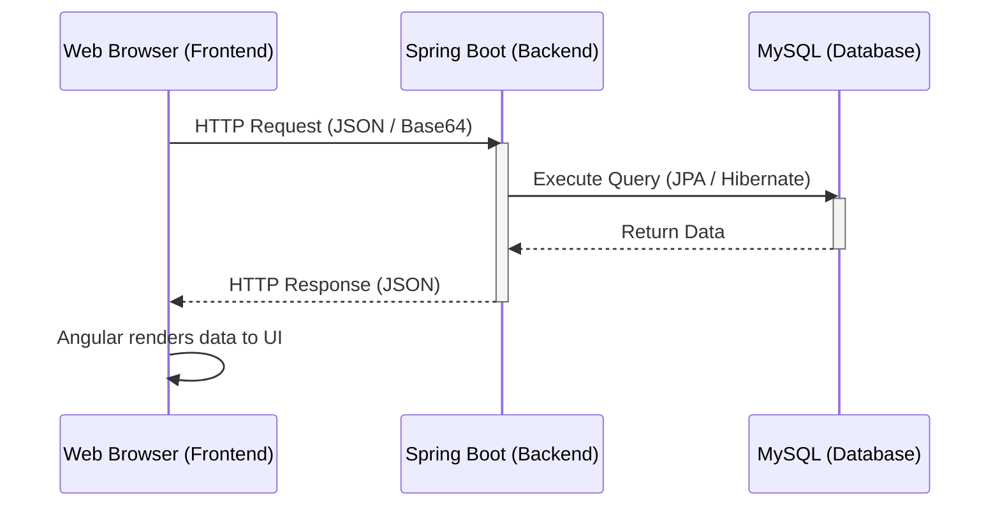
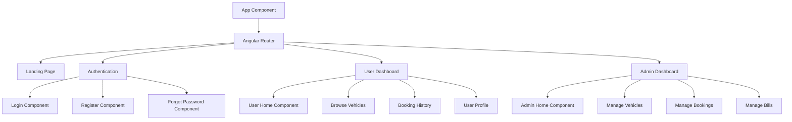

# RentalSphere: Frontend Architecture & Documentation

## 1. Overall Application Flow

The following diagram illustrates how the Angular Frontend, Spring Boot Backend, and MySQL Database interact with each other to serve the user.

---

## 2. Frontend Technology Stack
- **Framework**: Angular 21 (Standalone Components)
- **Language**: TypeScript
- **Styling**: Vanilla CSS (CSS Variables, Flexbox, CSS Grid)
- **Routing**: Angular Router
- **HTTP Client**: `HttpClient` (to communicate with the backend)

---

## 3. Core Architecture & Routing

RentalSphere uses a component-based architecture. The application is divided into public pages (Landing, Auth) and protected dashboards (User, Admin).

---

## 4. Component Details & Features

### Shared Components
- **Navbar (`navbar`)**: The top navigation bar. It is smart—it checks the `AuthService` to see if a user is logged in. If they are, it shows links specific to their role (Admin or User) and a Logout button.
- **Footer (`footer`)**: A globally available compact component displaying branding and customer support details. 

### Authentication Pages
- **Login (`login.ts`)**: Accepts Email and Password. Communicates with `/api/users/login`. On success, it stores the user's data in local storage and redirects them to their respective dashboard.
- **Register (`register.ts`)**: Collects full name, email, mobile, password, license, and role. Uses strict regex for validation (e.g., 10-digit mobile, strong password).
- **Forgot Password (`forgot-password.ts`)**: Validates the email and mobile number sequentially before allowing the user to reset their password via the backend.

### User Dashboard Pages
- **User Home (`user-home.ts`)**: The main landing area for logged-in users, displaying quick links to browse cars, view history, or manage their profile.
- **Browse Vehicles (`vehicles.ts`)**: Fetches all available vehicles from the backend. **Key Feature**: Dynamically displays uploaded Base64 images directly from the database, falling back to emojis if no image exists. Allows the user to book a vehicle.
- **Booking History (`history.ts`)**: Displays past and active bookings. It fetches the data and renders the status (e.g., Pending, Confirmed).
- **Profile (`profile.ts`)**: Displays the user's personal details and license information.

### Admin Dashboard Pages
- **Admin Home (`admin-home.ts`)**: The central hub for administrators with quick access to management tools.
- **Manage Vehicles (`manage-vehicles.ts`)**: 
  - **Feature**: Full CRUD (Create, Read, Update, Delete) for vehicles.
  - **Feature**: Image Uploading. Uses a `FileReader` to convert user-selected images into `Base64` strings before sending them to the backend in the JSON payload.
- **Manage Bookings (`manage-bookings.ts`)**: Allows admins to see all system bookings. Admins can **Approve** or **Reject** pending bookings. Approving a booking automatically triggers the generation of a Bill.
- **Manage Bills (`admin-bills.ts`)**: Displays all financial transactions (bills) generated from approved bookings.

---

## 5. Data Models & Services

### `models.ts`
Defines TypeScript Interfaces to ensure data strictly matches the backend:
- `User`: Contains `id`, `fullName`, `email`, `mobile`, `role`, `licenseNumber`.
- `Vehicle`: Contains `id`, `brand`, `model`, `type`, `pricePerDay`, `available`, `imageBase64`.
- `Booking`: Tracks rentals with `startDate`, `endDate`, `status`, and relations to `User` and `Vehicle`.
- `Bill`: Represents the final payment details.

### Services (`core/services/`)
- **`AuthService`**: Manages the currently logged-in user using browser `localStorage`.
- **`VehicleService`**: Handles HTTP `GET`, `POST`, `PUT`, `DELETE` requests to `/api/vehicles`.
- **`BookingService`**: Handles fetching, creating, and updating booking statuses at `/api/bookings`.
- **`BillService`**: Fetches generated bills from `/api/bills`.
